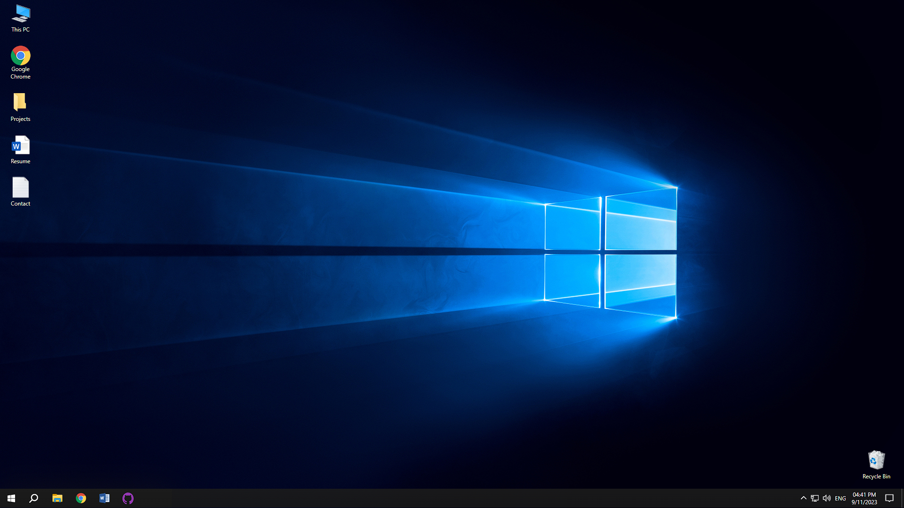

# Windows-Inspired Portfolio



## Overview

Welcome to the Windows-Inspired Portfolio project! This project is a web-based portfolio designed to mimic the look and feel of the Windows operating system. It includes a start menu, desktop, and interactive apps that showcase your projects, resume, and contact information in a unique and nostalgic way.

## Table of Contents

- [Features](#features)
- [Demo](#demo)
- [Installation](#installation)
- [Usage](#usage)
- [Customization](#customization)
- [Contributing](#contributing)
- [License](#license)

## Features

- **Start Menu**: A familiar Windows-inspired start menu that provides access to your portfolio's apps and content.

- **Desktop**: A desktop environment where you can place icons and interact with your portfolio items.

- **Apps**: Interactive apps that act as containers for your projects, resume, and contact information. These apps are designed to resemble real Windows applications.

- **Projects**: Showcase your projects in an engaging way. Each project can include images, descriptions, and links to more details.

- **Resume**: Display your resume or CV in a structured and readable format.

- **Contact**: Share your contact information, including links to social media profiles and email.

- **Responsive Design**: The portfolio is designed to work seamlessly on various screen sizes and devices.

## Demo

You can see a live demo of this portfolio [here](https://cojadev.github.io/WindowsPortfolio/).

## Installation

1. Clone the repository:

   ```bash
   git clone https://github.com/CojaDev/WindowsPortfolio
   ```

# Customization

You can customize the portfolio's appearance and content to suit your preferences:

- **Themes**: Change the color scheme and styling in the `css` directory.

- **Icons**: Replace the icons in the `apps/assets/icons` directory with your own icons.

- **Fonts**: Modify the font styles in the `css` directory by editing the CSS files.

## Contributing

Contributions to this project are welcome! If you have ideas for improvements or find bugs, please open an issue or submit a pull request.

## License

This project is licensed under the MIT License - see the [LICENSE](LICENSE) file for details.

---

Thank you for using the Windows-Inspired Portfolio project. We hope it helps you showcase your work in a creative and engaging way! If you have any questions or need assistance, feel free to reach out to us.
